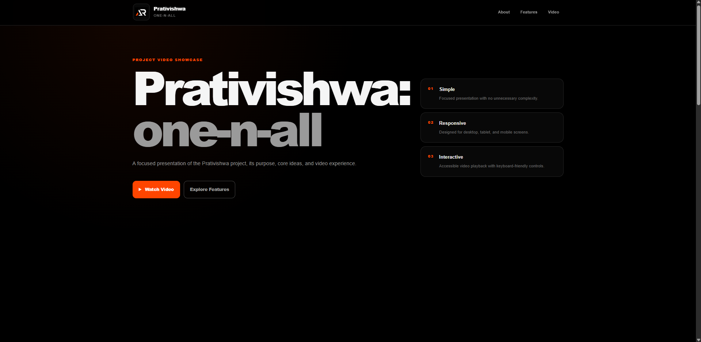

# Prativishwa Video Showcase

A lightweight and responsive video showcase for **Prativishwa: one-n-all**, built with HTML, CSS, and vanilla JavaScript.

The project presents the Prativishwa concept through a focused landing page with project highlights and an accessible full-screen video viewer.

## Preview



## Live Demo

[Open Live Project](https://a2rp.github.io/video_app_html_css_javascript/)

## Features

- Modern dark monochromatic interface
- Responsive layout
- Fixed responsive header
- Hide-on-scroll header behavior
- Desktop and mobile navigation
- Project introduction section
- Project feature cards
- Responsive YouTube video preview
- Full-screen video modal
- Automatic video playback when opened
- Video playback stops when the modal closes
- Escape key support
- Overlay click to close
- Modal focus management
- Background scroll locking
- Back-to-top control
- Semantic HTML
- Keyboard accessible controls
- Visible focus states
- SEO and social sharing metadata
- No jQuery
- No external JavaScript framework
- No unnecessary media libraries

## Tech Stack

- HTML5
- CSS3
- Vanilla JavaScript
- YouTube Embed
- GitHub Pages

## Project Structure

```text
video_app_html_css_javascript
├── public
│   ├── favicon.ico
│   ├── logo.png
│   └── preview.png
├── .gitignore
├── index.html
├── script.js
├── style.css
├── LICENSE
├── README.md
└── screenshot.png
```

## Run Locally

Clone the repository:

```bash
git clone https://github.com/a2rp/video_app_html_css_javascript.git
```

Open the project folder:

```bash
cd video_app_html_css_javascript
```

You can then open `index.html` directly in a browser or serve the folder with a local development server.

## Video

The project uses an embedded YouTube presentation that opens inside a responsive modal viewer.

The video is loaded only when the viewer is opened and is reset when the viewer is closed so playback does not continue in the background.

## Accessibility

The interface includes:

- Semantic buttons and navigation
- Keyboard accessible controls
- Escape key modal closing
- Focus management
- Focus trapping inside the video viewer
- Accessible dialog attributes
- Descriptive labels
- Visible keyboard focus states
- Reduced motion support

## Future Prospects

- Additional project videos
- Multiple showcase entries
- Video categories
- Search and filtering
- Local video support
- Additional project information sections

## License

This project is licensed under the MIT License.

See the [LICENSE](LICENSE) file for details.

## Links

- [Portfolio](https://www.ashishranjan.net)
- [GitHub](https://github.com/a2rp)
- [CodePen](https://codepen.io/ash1198)
- [LinkedIn](https://www.linkedin.com/in/aashishranjan)
- [Facebook](https://www.facebook.com/theash.ashish)
- [YouTube](https://www.youtube.com/channel/UCLHIBQeFQIxmRveVAjLvlbQ)
- [Email](mailto:ash.ranjan09@gmail.com)

## Support

- [Support](https://a2rp-donation-page.netlify.app/)
- [Buy Me a Coffee](https://buymeacoffee.com/a2rp)
- [Patreon](https://www.patreon.com/a2rp)
